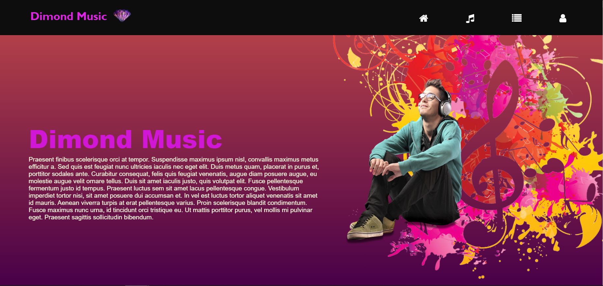
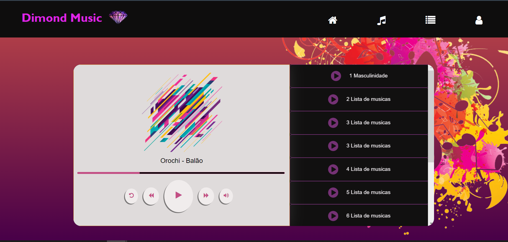
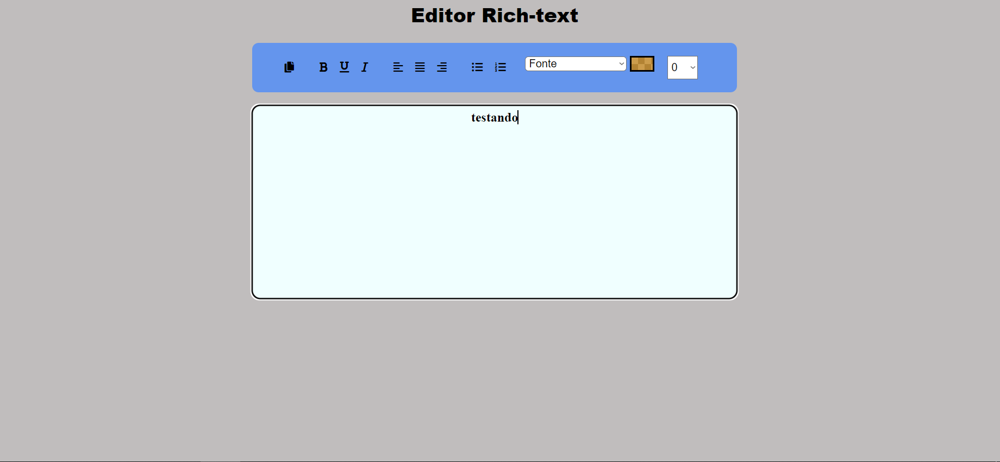

<h1> Template-example </h1>

 Ola Dev 

 Esse é um repositorio criado com base nos meus estudos desde paginas a projetos pessoais, aqui se encontram aplicações simples em HTML, CSS, JS, Node.js e React.
a ideia e sempre alimenta-lo conforme meus conhecimentos em novas tecnologias e criatividade aumentam.

Uma previa de algumas paginas criadas: 

<h2> Dimond music </h2>

<h2> Editor Rich-text </h2>

<h2> Twitter Home </h2>

